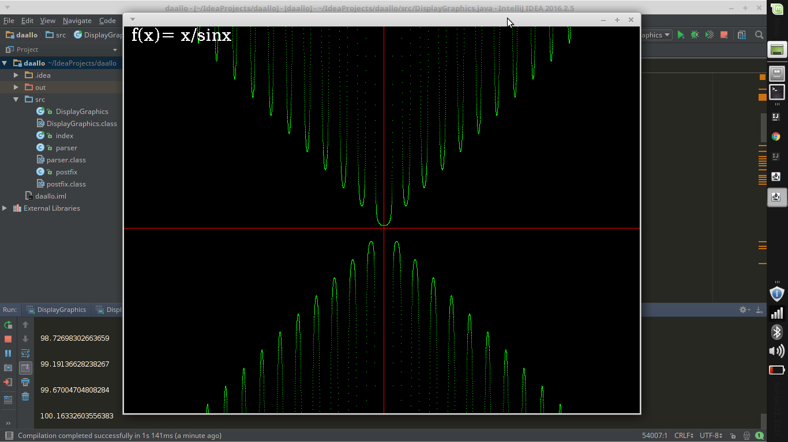
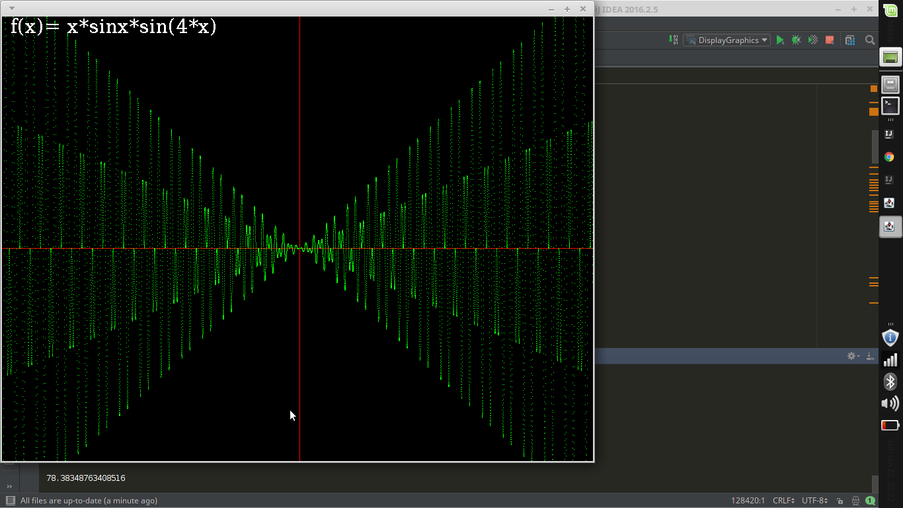
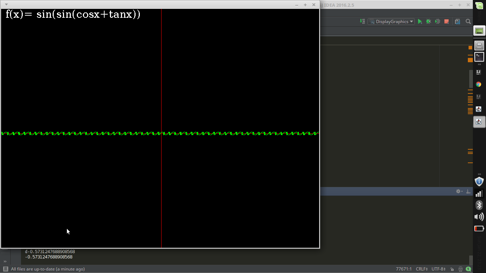
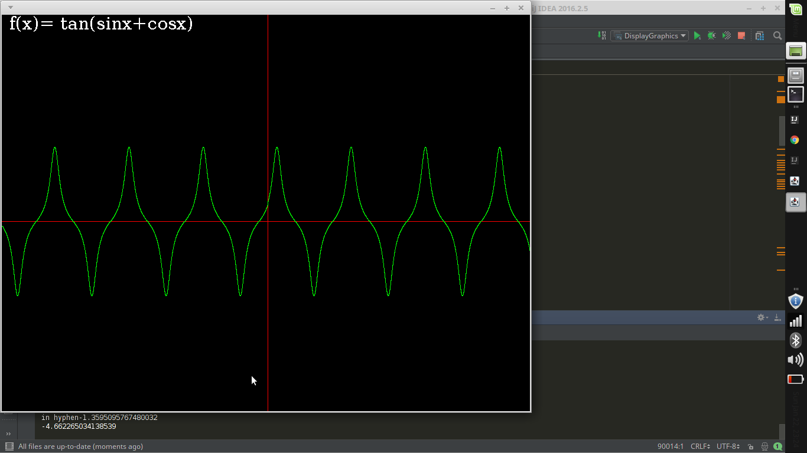
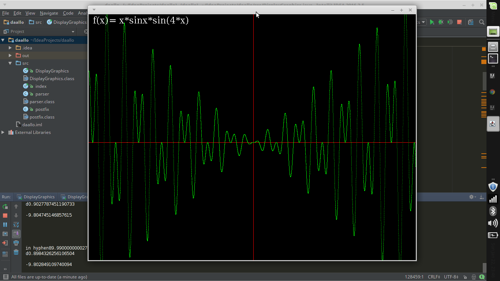
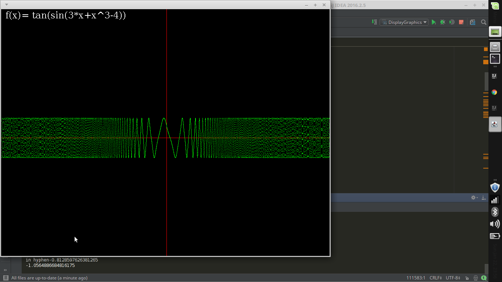
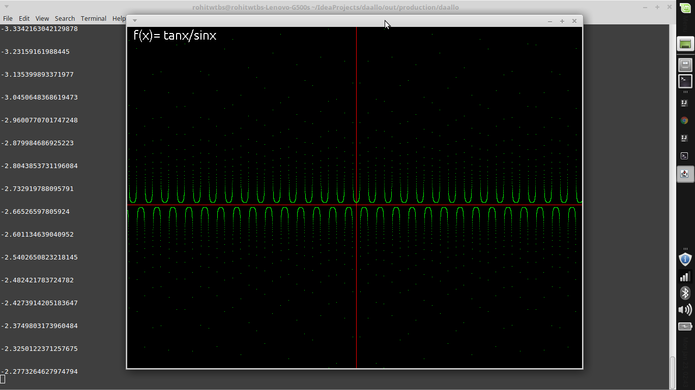
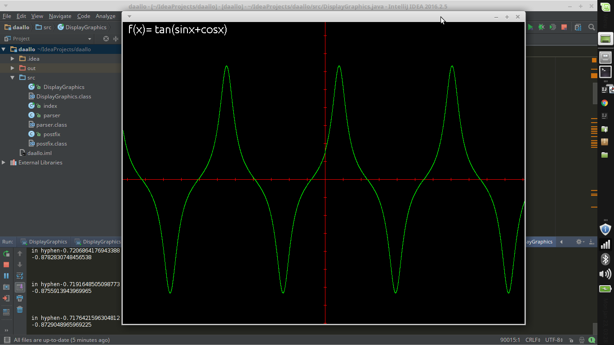
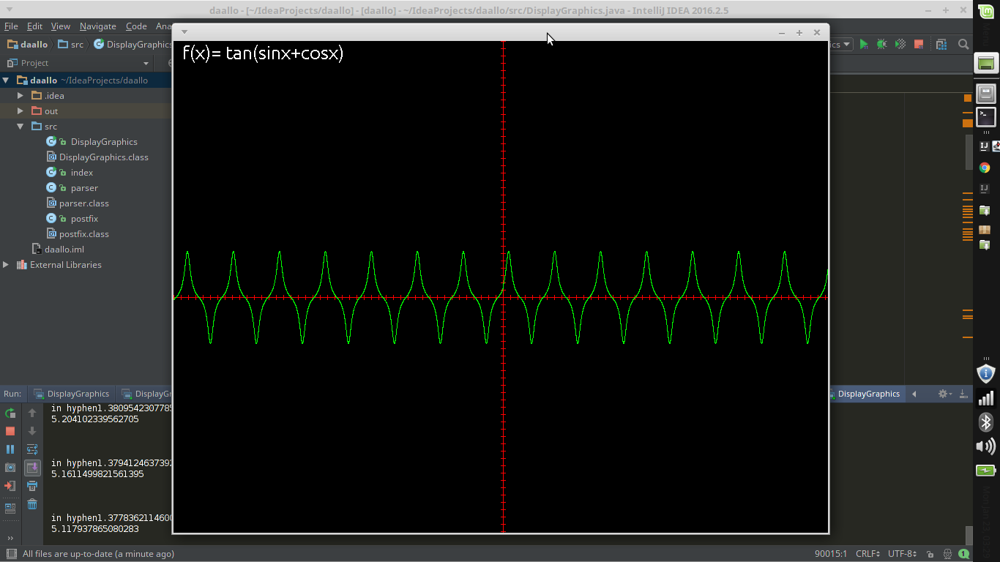

This project plotes the graph of a mathematical function . The expression May have trigonometric as well as log function. To run the project just compile the DisplayGraphics.java using "javac DisplayGraphics.java" ad then run the file using command "java DisplayGraphics" . 
The program will ask the scale of graph then expression after pressing the enter graph will be plotted.
This project was created by .
www.facebook.com/rohitwtbs
www.facebook.com/optimist2309 
https://www.facebook.com/abhishek.chaubey.142687?fref=ts
https://www.facebook.com/profile.php?id=100002519290848&fref=ts
Here is all screenshot of this project/

  

